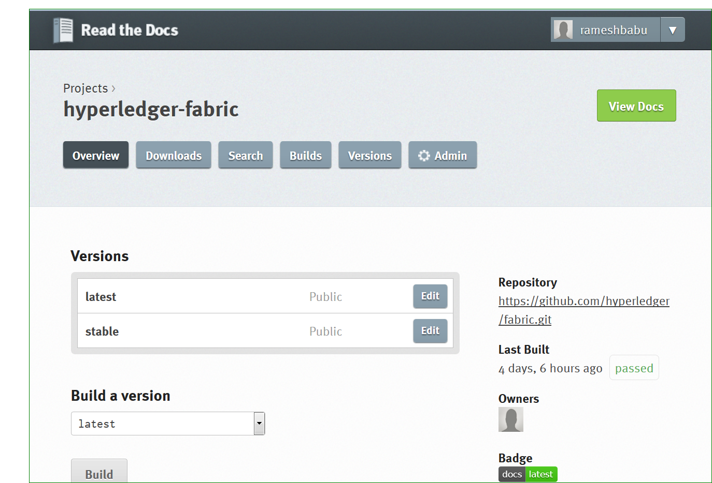

# Read the Docs

[**Read the Docs**](https://docs.readthedocs.io/en/latest/index.html) hosts documentation for the open source community. RTD pulls the code from Git repository, builds the documentation and host it in readthedocs servers.

RTD supports both `.rst and .md ` formats. We have choosen document type markdown as Hyperledger docs are prepared in `.md` format. 

**Continuous Documentation**:

Continuous Documentation is process of building documentation for every documentation change happens in [hyperledger/fabric](https://github.com/hyperledger/fabric) repository. ReadTheDocs is a open source tool to build the documentation and it also hosts the documentations.

**Create Webhook in git repository**:

Follow the below process to create ReadTheDocs webhooks in git repository.

1. Login to github repository
2. Click on `Settings` - `Webhooks & Services` - `Add Service` - Search for `ReadTheDocs` service and add it.
3. If the service is added and webhook is successfully created, you see a Green tick mark beside `ReadThedocs` service. 

**Configuring yaml configuration**:

Once create the webhooks, configure `mkdocs.yaml` configruation file in root of the fabric repository and also create `index.md` file in docs folder. See the fabric [`mkdocs.yaml`](https://github.com/hyperledger/fabric/blob/master/mkdocs.yml) file for reference. ReadTheDocs always look for mkdocs.yaml file and `index.md` file in git repository before it builds the documentation.

Also, create [`requirements.txt`](https://github.com/hyperledger/fabric/blob/master/docs/requirements.txt) file with required softwares instllation steps. RTD looks for this file to install required softwares in RTD build system to build documentation.

**Setup hyperledger/fabric git repo in ReadTheDocs**:

Sign up for an account on RTD, then log in. 
Visit your dashboard and click Import to add your project to the site. 
Fill in the name and description, then specify where your repository is located. This is normally the URL or path name you’d use to checkout, clone, or branch your code.

`Git: http://github.com/hyperledger/fabric.git` 

Add an optional homepage URL and some tags, then click “Create”.

Once webhooks and configuration file is setup in git repository, RTD automatically builds the documentation for every commit. 

**Know more about RTD Settings**:

**Settings:** While setting up RTD for fabric repository, you have to provide all the information like below:

1. **Name:** `hyperledger-fabric` (This name appears on RTD documentation site)

2. **Repository URL:** Provide github project repository

3. **Repository type:** Choose git

4. **Description:** Enter description about the project.

5. **Documentation Type:** Select Mkdocs(Markdown) - This supports .md files. Keep everything by default values and click on `submit` button.

**Advanced Settings**

1. **Requirements file:** Provide requirement.txt file path here. requirement.txt file should be availbale in root directory of fabric repository with required softwares.
2. **Default Branch:** Keep it blank or write the branch from where your documenation should build.
3. **Privacy Level:** Keep it private if you don't want to share these documents to public otherwise keep it as public.
4. **Python Interpreter:** Select CPython 2.x

**Reference**

